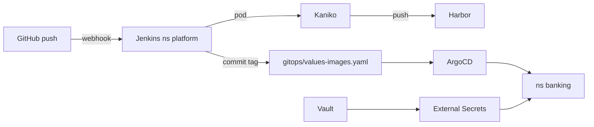

# Giai đoạn 9: GitOps Platform — CI trong K8s, CD ArgoCD

Phase 9 gom **platform** (Jenkins, Harbor, Vault, External Secrets) và **luồng GitOps** cho banking-demo **Phase 8** trên nền kiến trúc **Phase 5** (namespace tách: `banking`, `kong`, `redis`, `postgres`, `rabbit`).

## Mục tiêu

- **Mọi thứ trong cluster**, trừ repo GitHub (source code + manifest GitOps).
- **CI**: Jenkins Shared Library → pod Kaniko build image → push **Harbor**.
- **CD**: ArgoCD (App of Apps) đọc Git → Helm deploy; tag image do CI cập nhật `gitops/values-images.yaml`.
- **Secret**: HashiCorp Vault + External Secrets Operator (ESO), không commit plaintext.

## Namespace (theo Phase 5 + Phase 8)

| Namespace | Nội dung |
|-----------|----------|
| `argocd` | ArgoCD (bootstrap ngoài GitOps hoặc self-manage sau) |
| `platform` | Jenkins controller, Harbor (hoặc tách `jenkins`, `harbor`) |
| `vault` | Vault server |
| `external-secrets` | ESO controller |
| `postgres` | Postgres HA app DB (Phase 5) |
| `redis` | Redis HA (Phase 5) |
| `kong` | Kong HA DB mode (Phase 5) |
| `rabbit` | RabbitMQ (Phase 8) |
| `banking` | App Phase 8: frontend, api-producer, consumers, Ingress |

> Phase 8 README có chỗ ghi `banking-demo`; ArgoCD/Phase 5 chuẩn hoá **`banking`**. Phase 9 dùng `banking`.

## Cấu trúc thư mục

```text
phase9-gitops-platform/
├── PHASE9.md                          # File này
├── README.md                          # Quick start
├── bootstrap/
│   └── BOOTSTRAP.md                   # Thứ tự cài platform lần đầu
├── gitops/
│   ├── values-images.yaml             # CI cập nhật image tag (Harbor)
│   └── values-gitops-env.yaml         # Harbor host, project, branch (ít đổi)
├── argocd/
│   ├── project.yaml                   # AppProject mở rộng (mọi ns)
│   ├── app-of-apps.yaml               # Root Application
│   ├── README.md
│   └── applications/
│       ├── platform-app-of-apps.yaml
│       ├── infra-app-of-apps.yaml
│       ├── banking-app-of-apps.yaml
│       ├── platform/                  # Jenkins, Harbor, Vault, ESO
│       ├── infra/                     # postgres, redis, kong, rabbitmq
│       └── banking/                   # per-service Phase 8
├── jenkins-shared-library/            # Shared library skeleton
├── jenkins/
│   ├── Jenkinsfile.example
│   └── pod-templates/kaniko-pod.yaml
├── vault/
│   ├── README.md
│   └── external-secrets/              # ClusterSecretStore + ExternalSecret mẫu
└── harbor/
    └── README.md
```

## Luồng CI/CD



| Bước | Công cụ | Chi tiết |
|------|---------|----------|
| 1 | GitHub | Push vào `phase8-application-v3/**` |
| 2 | Jenkins | Shared library `bankingDemoPipeline` — lint/test (tùy chọn), Kaniko build |
| 3 | Harbor | `harbor.example.com/banking-demo/<service>:<sha>` |
| 4 | Jenkins | Commit `gitops/values-images.yaml` (tag = short SHA) |
| 5 | ArgoCD | Auto-sync Application banking → rollout Deployment |

## Build context (Phase 8)

Dockerfile build từ **repo root** (`.`), giống README Phase 8:

| Service | Dockerfile |
|---------|------------|
| api-producer | `phase8-application-v3/producer/Dockerfile` |
| auth-service | `phase8-application-v3/services/auth-service/Dockerfile` |
| account-service | `phase8-application-v3/services/account-service/Dockerfile` |
| transfer-service | `phase8-application-v3/services/transfer-service/Dockerfile` |
| notification-service | `phase8-application-v3/services/notification-service/Dockerfile` |
| frontend | `phase2-helm-chart/banking-demo` hoặc path frontend hiện tại (chưa đổi Phase 8) |

## Điều kiện tiên quyết

- Cluster K8s + kubectl
- ArgoCD đã cài (Phase 2) hoặc bootstrap theo `bootstrap/BOOTSTRAP.md`
- Phase 5 infra đã chạy hoặc deploy qua `infra-app-of-apps`
- Phase 8 code trong `phase8-application-v3/`

## Liên kết

- **Phase 5**: `phase5-architecture-refactor/` — namespace split, HA
- **Phase 8**: `phase8-application-v3/` — code + RabbitMQ + Kong routes
- **Phase 2**: `phase2-helm-chart/banking-demo/` — Helm chart + `values-phase8.yaml`
- **Phase 2 ArgoCD**: `phase2-helm-chart/argocd/` — tham khảo per-service apps (Phase 9 mở rộng)
